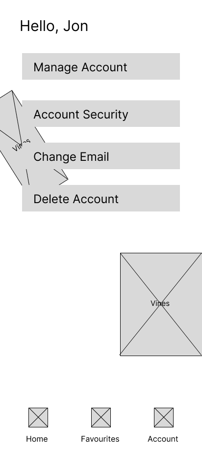

# Mobile App Design

## Quiet Study Spaces
Find peaceful, quiet study spaces around your area. Submitted from users.

### App Description:
Quiet Study Spaces is a mobile app designed to help students or remote workers find a nice place to study. Whether this be for school, university, work from home or simply needing a quiet place to recharge.

The app will allow users to find and share locations of study spaces. Users can use an inbuilt map to find location tags that indicate study spaces near them, with descriptions, photos and categories attached to each spot for easy user experience. The user can also filter their searches to find spots with specific features, like a cafe, or power outlets. Each study location will also have an associated 'like' amount, where users can see how good a spot is based on the amount of likes it has. Similarly, clicking on a study location will bring up photos submitted from other users so the current user can get a feel for the space before commiting to studying there.

### Main Features of Quiet Study Spaces:
##### Login/Authenticaion:
The Quiet Study Spaces app will have a login/signup page that will authenticate the users before allowing access to the rest of the app. This will be done through Firebase.

##### Home Page:
The home page of the app will be mainly taken up with the map. This map will use the users location and have location tags around their area for quiet spaces to go study.
The 1/3 - 1/4 of the home page will have some button options. These options include: Add Location, Filter Search.

##### Data Storage:
This app will store a few different types of data. First is the User Login Data. Second is the Location Tags and third is the associated filter data attached to the location and the 'likes'. The data for favourites will also be stored. 
This data will be stored in a remote database throught the use of either MongoDB or Firebase.

##### Add Location:
On the home page, there is a button called 'Add Location'. When pressed a modal will apear for the user to input some categories of the study location they are submitting. This will use the users current location.

##### Filter Locations:
Similar to the 'Add Location' button, there is a 'Filter Locations' button that will also pop up a modal. This modal will have categories for the user to fill out, including:
- Cafe/Food Options
- Power outlets available
- A view
- Collaborative study spaces
- Individual study spaces
- Library
- Wi-Fi Available
The user can choose which of these they want to include in their search.

##### Favourites:
Along the navigation bar, there will be a tab for favourites. When using the app, users can 'favourite' a study spot. Then when clicking on the favourites tab, the can find all their saved study spaces and click on which one they want, showing them where it is on the map.

##### Account Screen:
Along the navigation bar, there will be a tab for account. This is where users can manage their account. This includes features such as changing emails/passwords, deleting accounts and security settings like 2FA.

### Who are the users of Quiet Study Spaces?
The main target audience for Quiet Study Spaces is students, mainly in university in the age range of 18-26, however there is also a smaller target audience that includes a larger age range for high school students and remote workers. 

##### User Groups:
1. Univeristy Students - Primary User Group:
    - 18-26 age range.
    - Need quiet spaces for focused study session including study, lectures and assignment work.
    - May need Wi-Fi, Power Outlets and Coffee/Food.
    - Often moving between places or studying between part-time work.
2. High School Students - Secondary User Group:
    - 14-18 age range.
    - Need free after-school study spots, like libraries, to complete homework.
    - More likely to study collaboratively.
    - Need easy access as high scholl students are unlikely to have their own transport.
3. Remote Workers - Secondary User Group:
    - 24+ age range.
    - Need consistent workplaces with power outlets and Wi-Fi.
    - Preference for collaborative spaces / loud enviroments as they may have online meetings and need to talk.

##### Persona:
Name: Cleo
Gender: She/Her
Age: 18
Occupation: Macquarie Univeristy Student and Part Time Service Industry Worker.
Pain Points:
- Likes to study in a variety of different spots.
- Always wants something a drinl sip on when studying.
- Needs reliable Wi-Fi to access online textbooks.
- Sometimes needs very quiet workspaces to focus on harder tasks.
How Cleo Will Use the App:
- Can use the app to find many different and diversified study spaces all around the City, Macquarie and Bondi Junction. She can also use the associated photos to 'scope out' the space before going there.
- Can use the app to find cafe's for coffees
- Can filter study spaces to find locations with free Wi-Fi
- Can filter searches to find spaces that are good for individual, focused study.

##### Why the target audience would choose Quiet Study Spaces over competitors.
The main competitor to Quiet Study Spaces would be a simple google search. Users would choose this app over something like that because it is a specialised app that has more features. A google search would give nearby study spots but it would not give the deapth that this app gives with it's options to filter locations based on preferences. 
Using the 'Cleo' persona, she would use Quiet Study Spaces to have the ability to make more refined searches to meet her needs. The main competitor has very vauge search results that can sometimes be wrong, whereas Quiet Study Spaces will offer filtered locations that match the study space she needs that day.

### Design - Wireframes and mockups
For the Design of Quiet Study Spaces, the idea is to replicate the feel of a serene study space. This means a very clean, simple and tidy look to replicate that feeling. Similarly, the design needs a bit of life, just like a study space can use some plants. So plants will be incorporate into the design.

This clean design with a pop of colour from the plants its portrayed to the user with this colour palette. It uses simple white and black with a comfortable cream and the green for the plants.

#### WireFrames:
In order to keep the User Experience as easy as possible, keeping in mind the '3 tap rule', Quiet Study Spaces heavily leans on Modals. As can be seen by the below WireFrames, there is a modal for 'Add Location', a modal for 'Filter Location' and a small modal that will popup when the user clicks on a Study Space on the map. Similarly, for the '3 tap rule', the navigation bar down the bottom is easily visible, but does not have too many options. 
The most taps possible to get to any point in the app is 3. If a user has a modal open, it would take 1 click to close the modal, 1 click to access the accounts button on the navigation bar and one click to manage account. The limited screens of the app (by using modals), keep the user's flow easy and understandable.
Here is the wireframe for the simple sign in page:
  

And here is the Home Page and the Modal that will pop up when the use clicks on a location:

Here are the two modals that will popup from the home page when pressing the buttons 'Add Location' and 'Filter Locations'

The last 2 wireframes are for the other 2 options on the navigation bar along the bottom. The 'Favourites' Screen and the 'Account' Screen.

To increase visibility, Quiet Study Spaces keeps the UI simple and uncluttered, which can best be seen in the MockUps below.

To keep in mind universal Design Priciples, the simple layout of Quiet Study Spaces allows for large buttons with lots of room between. This can best be seen with the homescreen and modals below:

Lastly, the mock-ups for the favourites screen and the account screen:

### What will be implemented into MVP and what will be left out?
A Favourites screen will be included but for this MVP, clicking on a favourite will not lead anywhere. It will be just a list. Futher, future functionality should include clicking on a favourite spot and opening it on the map.